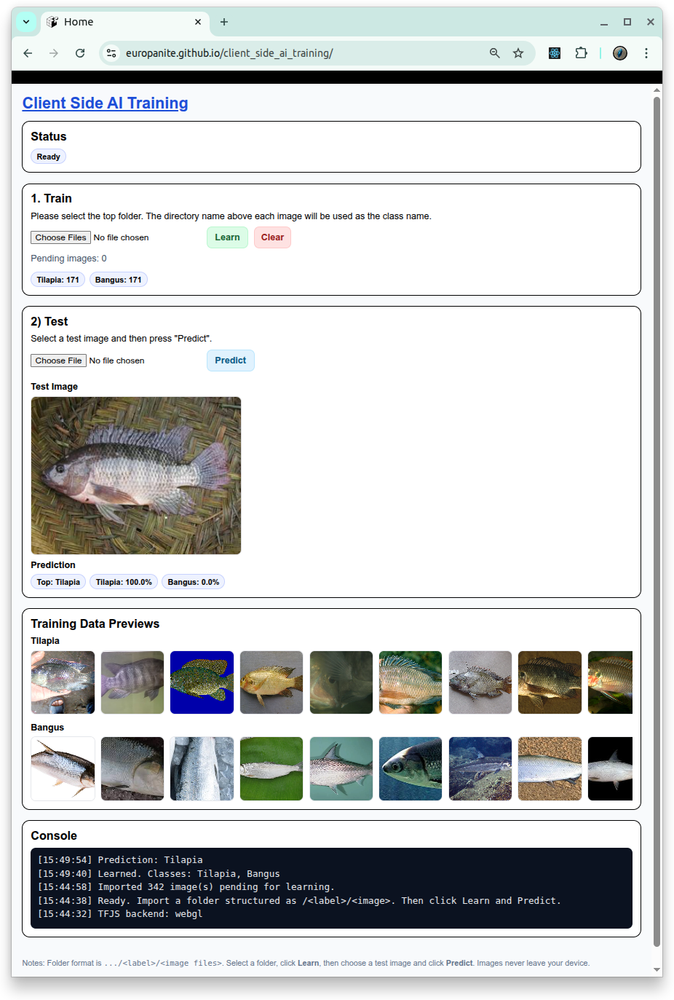

# [Browser Based AI Training](https://github.com/europanite/browser_based_ai_training "Browser Based AI Training")

[](https://github.com/europanite/browser_based_ai_training/actions/workflows/ci.yml)
[](https://github.com/europanite/browser_based_ai_training/actions/workflows/docker.yml)
[](https://github.com/europanite/browser_based_ai_training/actions/workflows/deploy-pages.yml)

A Browser-Based AI Training Playground. 



##  Demo
 [Browser Based AI Training](https://europanite.github.io/browser_based_ai_training/)

---

## 🚀 Getting Started

### 1. Prerequisites
- [Docker](https://www.docker.com/) & [Docker Compose](https://docs.docker.com/compose/)

### 2. Build and start all services:

```bash
# set environment variables:
export REACT_NATIVE_PACKAGER_HOSTNAME=${YOUR_HOST}

# Build the image
docker compose build

# Run the container
docker compose up
```
---

# License
- Apache License 2.0